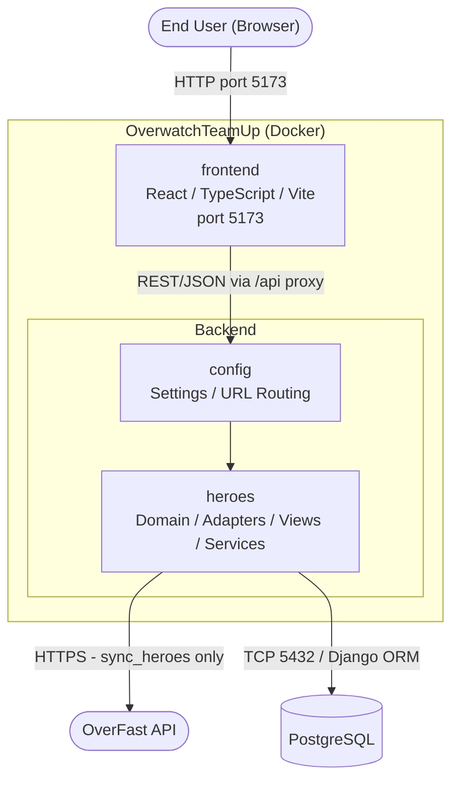
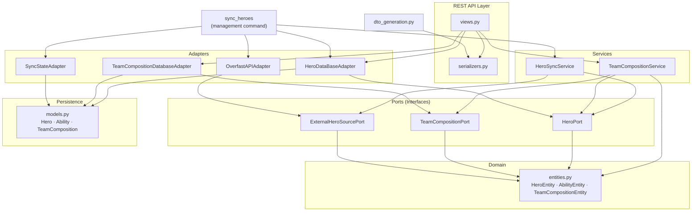
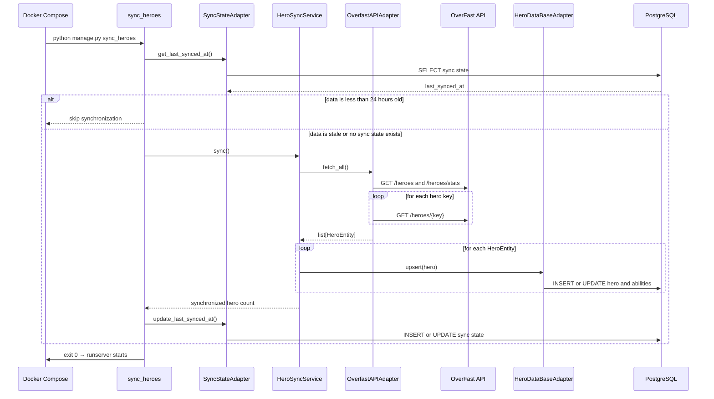
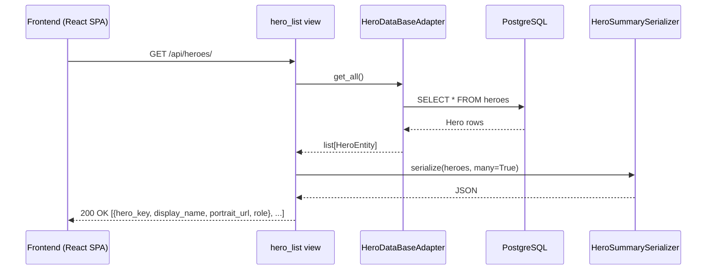
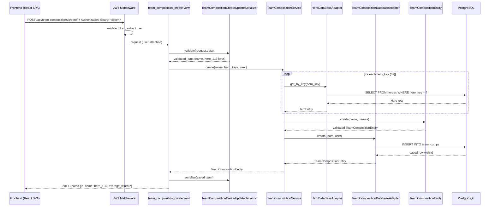
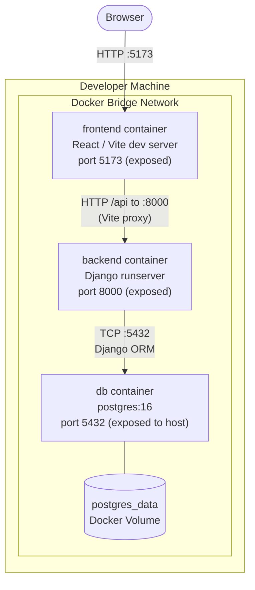

# Overwatch TeamUp Architecture Document
# Introduction and Goals 
## Requirements Overview 

OverwatchTeamUp is a web application that allows Overwatch players to browse hero statistics and assemble team compositions of five heroes. Hero data (stats, roles, abilities, win rates, pick rates) is sourced from the external OverFast API and stored locally to enable fast, reliable access. Users can create, view, update, and delete named team compositions tied to their account.

**Essential features:**

-   Browse all Overwatch heroes  

-   View detailed hero details including role, win rate, pick rate, health, abilities

-   Register and authenticate as a user (JWT-based)

-   Create and manage personal team compositions (5 heroes per team)

-   Hero data kept current via a sync mechanism against the external OverFast API

## Quality Goals 

| Priority | Quality Goal | Motivation | Metric |
|----------|-------------|------------|--------|
| 1 | **Reliability** | Hero data should remain available when the external API is temporarily unreachable | Hero endpoints read from PostgreSQL rather than OverFast; a failed startup sync logs a warning and keeps the application running unless `--fail-on-error` is set |
| 2 | **Security** | Team compositions are private per user; authentication and authorization must be enforced | Endpoint tests cover unauthenticated access (401) and cross-user access (404); access tokens expire after 5 minutes |
| 3 | **Maintainability** | Ports and adapters keep the core use cases independent of PostgreSQL and OverFast | Architecture tests enforce the allowed module dependencies; application services depend on ports rather than concrete adapters |
| 4 | **Correctness** | Hero stats displayed should reflect the latest successful synchronization | Adapter and integration tests cover response mapping, persistence, and updates by hero key |
| 5 | **Usability** | API responses should be predictable for frontend consumption | Endpoint tests check the JSON structures, and generated TypeScript DTOs reduce contract drift between backend and frontend |

## Stakeholders 

| Role/Name | Contact | Expectations |
|-----------|---------|--------------|
| Overwatch Players (end users) | — | Quickly look up hero stats and plan team compositions without leaving the app |
| Development Team | — | Clear architecture boundaries, testable code, and documented API contracts |

# Architecture Constraints 

| Constraint | Explanation |
|------------|-------------|
| **React / TypeScript / Vite frontend** | We selected React 19 with TypeScript and Vite as the frontend stack; switching frameworks would require a full rewrite of all components |
| **Python / Django backend** | We selected Python and Django for the backend; the technology stack is fixed for the duration of the project |
| **PostgreSQL as database** | We selected PostgreSQL because of our familiarity with it and the available infrastructure; switching engines would require significant migration effort |
| **OverFast API as sole hero data source** | All hero data originates from this third-party public API. It has no SLA and no authentication, meaning it can change or go offline at any time. Hero data must therefore be cached locally rather than fetched live |
| **OverFast API data limitations** | Win rate and pick rate are only available for competitive PC EU rankings. Other regions, platforms, or game modes are not covered |

# Context and Scope {#section-context-and-scope}

OverwatchTeamUp interacts with two external parties: the end users who use the web interface, and the OverFast API from which all hero data originates. Everything else (the React frontend, Django backend, and PostgreSQL database) is internal to the system.

## Business Context {#_business_context}

| Communication Partner | Inputs to the system | Outputs from the system |
|-----------------------|---------------------|------------------------|
| **Overwatch Player (End User)** | Hero search queries, hero slot selections, login/register credentials, team save/update/delete actions | Rendered hero stats and portraits, team composition UI, authentication forms, confirmation feedback |
| **OverFast API** | Hero roster, hero detail (role, abilities, stats, portrait), hero win rate and pick rate per hero key | HTTP GET requests to `/heroes`, `/heroes/{key}`, `/heroes/stats` |

The end user interacts exclusively through the React frontend, never directly with the REST API or the OverFast API. All hero data enters the system through the `sync_heroes` management command and is served to users from the local database.

## Technical Context {#_technical_context}

| Partner | Channel | Protocol | Direction | Notes |
|---------|---------|----------|-----------|-------|
| End User (browser) | TCP port 5173 (dev) | HTTP | Bidirectional | User navigates the React SPA; no direct contact with the backend |
| Frontend → Backend | Vite proxy (`/api` → `http://backend:8000`) in dev; direct HTTP in prod | REST/JSON | Bidirectional | JWT passed as `Authorization: Bearer <token>` on authenticated requests; tokens stored in `localStorage` |
| OverFast API (`overfast-api.tekrop.fr`) | HTTPS | REST/JSON | Pull (system initiates; hero data flows back as response) | Called exclusively by `OverfastAPIAdapter` during `sync_heroes`; three endpoints used: `/heroes`, `/heroes/{key}`, `/heroes/stats` |
| PostgreSQL database | TCP port 5432 (internal Docker network) | PostgreSQL wire protocol | Bidirectional | Accessed via Django ORM; not reachable from outside the Docker network |

# Solution Strategy {#section-solution-strategy}

| Decision | Rationale | Quality Goal |
|----------|-----------|--------------|
| **Hexagonal Architecture (Ports & Adapters)** | Team composition management and hero synchronization use explicit ports and adapters. Authentication and simple hero queries remain closer to standard Django layering. | Maintainability |
| **Local hero data cache** | Hero data is synced from OverFast into PostgreSQL rather than fetched live per request. The app continues to serve hero data even if the external API is unreachable. | Reliability |
| **`sync_heroes` as the single external API entry point** | The startup command is the only path to OverFast. It skips synchronization when the stored data is less than 24 hours old. | Reliability, Maintainability |
| **JWT stateless authentication** | Short-lived JWT access tokens protect authenticated endpoints without a server-side session. Refresh tokens are blacklisted during logout. | Security |
| **TypeScript DTO generation** | `dto_generation.py` derives frontend types from DRF serializers. Regenerating the file after serializer changes reduces manual duplication but remains an explicit development step. | Correctness |

# Building Block View {#section-building-block-view}

## Whitebox Overall System {#_whitebox_overall_system}

The backend is a single Django project containing one application module (`heroes`) that holds all domain logic, API endpoints, and data access code. The `config` package is the Django project root and has no business logic.

| Building Block | Responsibility |
|----------------|----------------|
| **`frontend`** (React / TypeScript / Vite SPA) | Renders the user interface; browses heroes, builds team compositions, handles login/register; communicates with the backend via REST/JSON |
| **`heroes`** (Django app) | All domain logic, REST API endpoints, data persistence, external API sync, and DTO generation |
| **`config`** | Django project settings, root URL routing (`/api/` to `heroes`), WSGI/ASGI entry points |

The `heroes` app contains all backend business logic. The frontend is a separate process that communicates with it over HTTP. Everything described in Level 2 is internal to the backend.

## Level 2 — `heroes` App Decomposition {#_level_2}

The `heroes` app is organized into layers following the Hexagonal Architecture pattern. Dependencies flow inward: views and adapters depend on ports and domain; domain depends on nothing.

| Layer | Package / File | Responsibility |
|-------|----------------|----------------|
| **Domain** | `heroes/domain/entities.py` | Pure Python dataclasses (`HeroEntity`, `AbilityEntity`, `TeamCompositionEntity`); no framework imports |
| **Ports** | `heroes/ports/` | Abstract interfaces: `HeroPort`, `TeamCompositionPort`, `ExternalHeroSourcePort`; define contracts without implementations |
| **Database Adapters** | `heroes/adapters/hero_database_adapter.py`, `team_composition_adapter.py` | Implement `HeroPort` and `TeamCompositionPort`; translate between Django ORM models and domain entities |
| **External API Adapter** | `heroes/adapters/overfast_api_adapter.py` | Implements `ExternalHeroSourcePort`; fetches hero data from the OverFast API and maps responses to domain entities |
| **Application Services** | `heroes/services/hero_sync_service.py`, `team_composition_service.py` | Coordinate hero synchronization and team composition use cases through port interfaces |
| **Django Models** | `heroes/models.py` | ORM schema: `Hero`, `Ability`, `TeamComposition`; persistence only, no domain logic |
| **Views** | `heroes/views.py` | DRF function-based views. Team composition endpoints call `TeamCompositionService`; hero queries use `HeroDataBaseAdapter` directly; authentication uses DRF and Simple JWT |
| **Serializers** | `heroes/serializers.py` | Translate between domain entities and JSON; `HeroSummarySerializer`, `HeroSerializer`, `TeamCompositionSerializer`, `TeamCompositionCreateUpdateSerializer`, `RegisterSerializer` |
| **Management Commands** | `heroes/management/commands/sync_heroes.py` | Startup entry point that checks the last successful sync and wires the concrete adapters into `HeroSyncService` |
| **Sync State Adapter** | `heroes/adapters/sync_state_adapter.py` | Stores the time of the last successful synchronization through the Django ORM; currently has no port interface |
| **DTO Generation** | `heroes/dto_generation.py`, `heroes/management/commands/generate_dtos.py` | Generates TypeScript types from DRF serializers when the command is run |

# Runtime View {#section-runtime-view}

The following scenarios show the startup synchronization, a direct hero query, and a team composition request that passes through an application service.

## RT-01: Startup Hero Sync {#_rt_01}

Docker Compose invokes `sync_heroes` whenever the backend container starts. The command contacts OverFast only if no successful sync exists or the stored data is at least 24 hours old.

## RT-02: Hero List Request {#_rt_02}

The frontend requests all heroes on load (via `SideBar.tsx`). The OverFast API is not involved — data is served entirely from the local database.

## RT-03: Create Team Composition {#_rt_03}

An authenticated user saves a team composition via the frontend (via `TeamComposition.tsx`). The JWT middleware validates the token before the view is reached. Each hero key in the request body is resolved to a `HeroEntity` before the composition is persisted.

# Deployment View {#section-deployment-view}

## Infrastructure Level 1 — Docker Compose (Development) {#_infrastructure_level_1}

All three application processes run as Docker containers on a single host, connected by a Docker bridge network. The database persists data through a named Docker volume.

**Startup sequence** (enforced by `depends_on` and health checks):

1. `db` starts and passes `pg_isready` health check
2. `backend` starts: runs `migrate`, invokes `sync_heroes` (which may skip fresh data), then starts `runserver 0.0.0.0:8000`
3. `frontend` starts: runs `npm run dev -- --host` (Vite proxies `/api` to `http://backend:8000`)

## Building Block to Container Mapping {#_bb_mapping}

| Building Block | Container | Entry Point |
|----------------|-----------|-------------|
| `frontend` (React SPA) | `frontend` | Vite dev server (`npm run dev`) |
| `config` + `heroes` (Django backend) | `backend` | `manage.py runserver` |
| PostgreSQL database | `db` | postgres:16 default entrypoint |

## Production Note {#_production_note}

The current setup is development-only. A production deployment would require:

| Concern | Dev (current) | Production |
|---------|--------------|------------|
| Backend server | `manage.py runserver` | Gunicorn (WSGI) |
| Frontend serving | Vite dev server (HMR) | Nginx serving `vite build` static output |
| API routing | Vite proxy | Nginx reverse-proxying `/api` to Gunicorn |
| Django settings | `DEBUG=True`, insecure secret key | `DEBUG=False`, `ALLOWED_HOSTS` set, secret key from env |
| HTTPS | None | TLS termination at Nginx or load balancer |

# Architecture Decisions {#section-design-decisions}

## ADR-01: Python and Django as Backend Technology {#_adr_01}

| Field | Content |
|-------|---------|
| **Status** | Accepted |
| **Context** | OverwatchTeamUp is a student project. We chose Python to gain practical experience with a new language. The backend needed to expose a REST API, manage a PostgreSQL database, and synchronize hero data from an external API. |
| **Decision** | Use Python as the backend language and Django with Django REST Framework (DRF) as the web framework. |
| **Consequences** | (+) We gained practical experience with Python and Django. (+) Django ORM, DRF serializers, and management commands cover most backend infrastructure needs. (−) The project uses only part of Django's full-stack feature set. |

---

## ADR-02: React and TypeScript for the Frontend {#_adr_02}

| Field | Content |
|-------|---------|
| **Status** | Accepted |
| **Context** | OverwatchTeamUp is a student project. We chose React and TypeScript to gain practical experience with a new UI library and programming language. The web frontend needed to let users browse heroes and manage team compositions. We also wanted type safety, a component-based UI, and a modern development experience. |
| **Decision** | Use React 19 with TypeScript and Vite as the build tool. MUI is used for UI components. TypeScript DTOs are auto-generated from DRF serializers via `dto_generation.py`. |
| **Consequences** | (+) React components separate the main UI concerns. (+) TypeScript catches many DTO mismatches during the build. (+) Vite provides fast local startup and hot module replacement. (−) Generated DTOs must be refreshed explicitly after serializer changes. |

---

## ADR-03: Hexagonal Architecture (Ports & Adapters) {#_adr_03}

| Field | Content |
|-------|---------|
| **Status** | Accepted |
| **Context** | The backend depends on two external systems, the OverFast API and PostgreSQL, that could change independently of the business logic. We wanted to test the domain without live infrastructure and replace external systems without modifying the core logic. |
| **Decision** | Apply the Hexagonal Architecture pattern. The domain layer (entities, services) has no framework or infrastructure dependencies. All external dependencies are accessed through abstract port interfaces (`HeroPort`, `TeamCompositionPort`, `ExternalHeroSourcePort`). Concrete adapters implement those ports and live outside the domain. |
| **Consequences** | (+) `HeroSyncService` and `TeamCompositionService` can be tested with in-memory port implementations. (+) OverFast and database access remain outside these services. (−) The additional interfaces and mappings add indirection. (−) Authentication and simple hero queries do not yet follow the same structure. |

---

## ADR-04: PostgreSQL as the Database {#_adr_04}

| Field | Content |
|-------|---------|
| **Status** | Accepted |
| **Context** | The application needs to persist hero data, user accounts, and team compositions. The data is relational by nature, heroes are referenced by team compositions, compositions belong to users. A reliable, well-supported database with strong Django ORM integration was needed. |
| **Decision** | Use PostgreSQL 16 as the primary database, running as a Docker container in development. |
| **Consequences** | (+) Well-suited to the relational data model; foreign key constraints enforce referential integrity between heroes, team compositions, and users. (+) Django's ORM has first-class PostgreSQL support. (+) Running in Docker keeps the local setup consistent across machines. (−) Switching database engines would require migration effort and potential ORM query changes. (−) Heavier than SQLite for local development, though Docker Compose handles this transparently. |

# Quality Requirements {#section-quality-scenarios}

The top five quality requirements are defined in section 1.2 with concrete metrics. This section adds lower-priority requirements and expands each goal into a detailed scenario.

## Quality Requirements Overview {#_quality_requirements_overview}

| Category | Quality Requirement |
|----------|-------------------|
| Reliability | Hero data remains available when the OverFast API is unreachable |
| Security | Users can only access and modify their own team compositions |
| Maintainability | External data source can be replaced without changes to domain logic |
| Correctness | Hero stats in the database match the upstream API after every sync |
| Usability | API responses are fast and follow a consistent, documented structure |
| Testability | Domain logic and adapters can be tested independently without a live database or external API |
| Interoperability | The REST API can be consumed by any frontend framework without backend changes |

## Quality Scenarios {#_quality_scenarios}

### QS-01: Hero Data Available When External API Is Down

| Field | Description |
|-------|-------------|
| **Scenario ID** | QS-01 |
| **Scenario Name** | Hero Data Available When External API Is Down |
| **Source** | End user |
| **Stimulus** | User requests the hero list while the OverFast API is unreachable |
| **Environment** | Normal runtime; OverFast API is down or timing out |
| **Artifact** | `HeroDataBaseAdapter`, PostgreSQL database |
| **Response** | The system serves hero data from the local database without contacting the external API |
| **Response Measure** | Hero list endpoint returns HTTP 200 from cached database data without an outbound request to OverFast |

---

### QS-02: Unauthenticated Access to Team Compositions Rejected

| Field | Description |
|-------|-------------|
| **Scenario ID** | QS-02 |
| **Scenario Name** | Unauthenticated Access to Team Compositions Rejected |
| **Source** | Anonymous user or client without a JWT token |
| **Stimulus** | GET request to `/api/team-compositions/` without an Authorization header |
| **Environment** | Normal runtime |
| **Artifact** | `team_composition_list` view, JWT authentication middleware |
| **Response** | The system rejects the request without exposing any data |
| **Response Measure** | HTTP 401 returned; no team composition data included in the response |

---

### QS-03: User Cannot Access Another User's Team Composition

| Field | Description |
|-------|-------------|
| **Scenario ID** | QS-03 |
| **Scenario Name** | Cross-User Data Isolation |
| **Source** | Authenticated user |
| **Stimulus** | User A sends a GET request for a team composition owned by User B |
| **Environment** | Normal runtime; User A holds a valid JWT |
| **Artifact** | `TeamCompositionDatabaseAdapter`, `team_composition_detail` view |
| **Response** | The system treats the resource as non-existent for User A |
| **Response Measure** | HTTP 404 returned; User B's data is not exposed |

---

### QS-04: External API Adapter Can Be Replaced

| Field | Description |
|-------|-------------|
| **Scenario ID** | QS-04 |
| **Scenario Name** | External API Adapter Replacement |
| **Source** | Developer |
| **Stimulus** | OverFast API is replaced by a different hero data source |
| **Environment** | Development; new data source has a different response format |
| **Artifact** | `overfast_api_adapter.py`, `ExternalHeroSourcePort` |
| **Response** | Developer adds an adapter implementing `ExternalHeroSourcePort` and changes the concrete wiring in the sync command; domain entities and `HeroSyncService` remain unchanged |
| **Response Measure** | Architecture tests and existing service tests pass without changes to the port or application service |

---

### QS-05: Hero Stats Match Upstream After Sync

| Field | Description |
|-------|-------------|
| **Scenario ID** | QS-05 |
| **Scenario Name** | Hero Stats Correctness After Sync |
| **Source** | `sync_heroes` management command (triggered at startup) |
| **Stimulus** | `sync_heroes` completes successfully |
| **Environment** | Normal startup; OverFast API is reachable |
| **Artifact** | `OverfastAPIAdapter`, `HeroSyncService`, PostgreSQL database |
| **Response** | All heroes returned by the OverFast API are present in the local database with matching stats |
| **Response Measure** | Hero count in DB equals hero count from API; winrate and pickrate values match the API response for every hero key |

---

### QS-06: Hero Endpoints Respond Within Acceptable Time

| Field | Description |
|-------|-------------|
| **Scenario ID** | QS-06 |
| **Scenario Name** | Hero Endpoint Response Time |
| **Source** | End user or frontend client |
| **Stimulus** | GET request to `/api/heroes/` or `/api/heroes/{key}/` |
| **Environment** | Normal runtime; hero data is present in the database |
| **Artifact** | `hero_list` and `hero_detail` views, `HeroDataBaseAdapter` |
| **Response** | The system queries the local database and returns a serialized response |
| **Response Measure** | Performance target: response delivered within 200ms in the development environment; this target is not currently enforced by an automated performance test |

# Risks and Technical Debts {#section-technical-risks}

## Risks

| Priority | Risk | Impact | Mitigation |
|----------|------|--------|------------|
| High | **OverFast API has no SLA** — its response format or availability can change without notice | Synchronization fails and locally cached hero data becomes stale | Continue serving cached data; log failed syncs; add monitoring or an operational alert |
| Medium | **Win rate and pick rate data is narrow** — only sourced from EU competitive PC rankings | Stats may be misleading or irrelevant for players in other regions or game modes | Make the region and game mode configurable; document the data source clearly in the UI |
| Medium | **No rate limiting on any endpoint** — the API is fully open | A client could hammer endpoints, degrading performance for all users | Add rate limiting via Django middleware or a reverse proxy |

## Technical Debts

| Priority | Debt | Impact | Suggested Fix |
|----------|------|--------|---------------|
| High | **Fixed 5-hero team schema** — team size is represented by five separate foreign key columns | Supporting a different team size requires a schema change and migration | Introduce team-slot records linked to a composition |
| Medium | **Adapter wiring is distributed** — views and management commands instantiate concrete adapters directly | Replacing an adapter requires finding each construction site, and some paths bypass application services | Introduce a small composition root and route hero queries through an application service |
| Medium | **Sync state has no port** — `sync_heroes` uses `SyncStateAdapter` directly | The freshness decision requires a database-backed adapter in command tests | Add a sync-state port if the freshness policy moves into an application service |
| Low | **No pagination on the hero list endpoint** | The current roster is small, but the endpoint always returns every hero | Add pagination if the data set or response payload grows materially |

# Glossary {#section-glossary}

| Abbreviation | Definition                |
|--------------|---------------------------|
| DTO          | Data Transfer Object      |
| DRF          | Django REST Framework     |
| JWT          | JSON Web Token            |
| ORM          | Object-Relational Mapping |
| SPA          | Single Page Application   |

| Term             | Definition                                                                                                                                                        |
|------------------|-------------------------------------------------------------------------------------------------------------------------------------------------------------------|
| Hero             | A playable game character in Overwatch with different abilities that falls under one of three categories: Tank, Damage, Support.                                  |
| Overwatch        | A live service multiplayer first-person shooter video game by Blizzard Entertainment, in which teams of five or six fight against one another in different modes. |
| Team Composition | A team composition consists of five Heroes, fulfilling the following roles: Tank, Damage (2x), Support (2x)                                                       |
